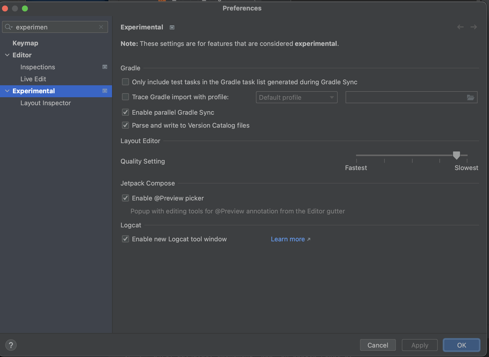

Thank you for this youtube!

https://www.youtube.com/watch?v=zCIfBbm06QM&ab_channel=PhilippLackner

## memo

Tools > Firebase > Authentication

アプリ設定 > SHA 証明書フィンガープリント

gradle > android > signingReport > SHA1 の値を firebase にコピーする。
