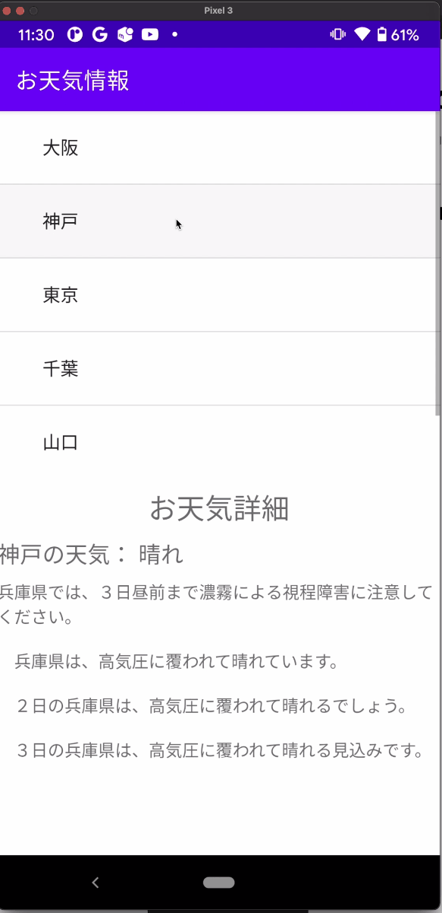
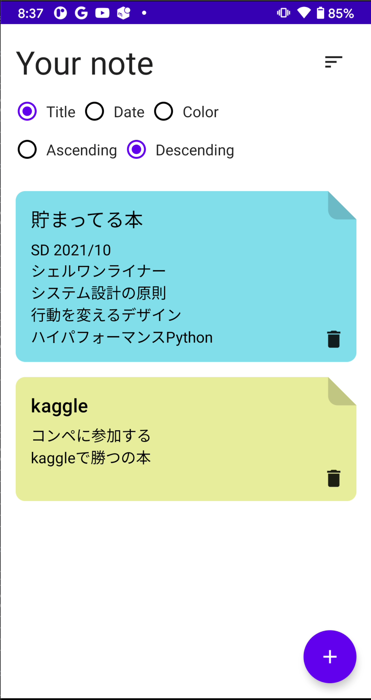
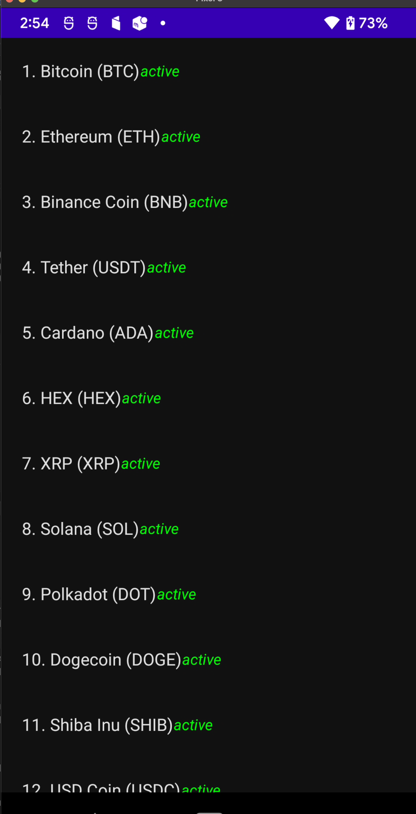
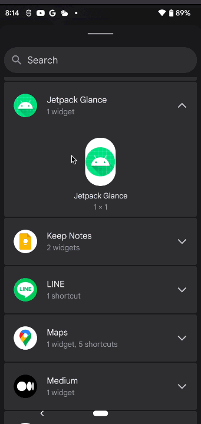

# Android で学んだこと
- [作って学ぶAndroidアプリ開発](https://www.amazon.co.jp/%E4%BD%9C%E3%81%A3%E3%81%A6%E5%AD%A6%E3%81%B6Android%E3%82%A2%E3%83%97%E3%83%AA%E9%96%8B%E7%99%BA-Kotlin%E5%AF%BE%E5%BF%9C-%E6%9C%89%E5%B1%B1-%E5%9C%AD%E4%BA%8C/dp/4297113430)
  - [公式](https://gihyo.jp/book/2020/978-4-297-11343-8/support)
  - 6/28~

Requirements
------------

To try jetpack compose samples, you need to use [Android Studio Arctic Fox](https://developer.android.com/studio).

Samples
------------

| Projects |  |
|:-----|:---------:|
|  Java  A sample Program to use API in the background. This project is managed by different repo.   • AsyncTask  **[> Browse](https://github.com/kokoichi206/til/tree/main/android/android_text/AsyncSample/app/src/main)** |  |  
|  |  |  
|  Java  A sample Program of a game. This project is managed by different repo.   • GameLoop  **[> Browse](https://github.com/kokoichi206/til/tree/main/android/FlyGame/app/src/main)** |  |  
|  |  |  
|  Kotlin  **Jetpack compose**  A sample Program of Clean Architecture and jetpack compose.   • Clean Architecture  • Jetpack Compose  • Local storage with Room  • Showing [Snackbars](https://material.io/components/snackbars) with Compose  **[> Browse](CleanArchitecture/app/src)** |  |  
|  |  |  
|  Kotlin  **Jetpack compose**   • MVVM  • Jetpack Compose  • API access (refrofit)  • API test  • Room DAO  • Uses [Hilt](https://dagger.dev/hilt/) for dependency injection  **[> Browse](MyApplication/app/src/main)** |  |  
|  |  |  
|  Kotlin  **Jetpack compose**   • Jetpack Compose  • Splash Screen  • Custom font  • UI tests  **[> Browse](SplashScreen/app/src/main)** |  |  
|  |  |  
|  Kotlin  **Jetpack compose**   • [Jetpack Glance](https://developer.android.com/jetpack/androidx/releases/glance?hl=ja)  • Widget by Jetpack  • Similar to Jetpack Compose  **[> Browse](JetpackGlance/app/src/main)** |  |  
|  |  |  
|  Kotlin  **Jetpack compose**   • [android-maps-compose](https://github.com/googlemaps/android-maps-compose)  • [Snazzy maps](https://snazzymaps.com/style/87718/fallout-pip-boy)   • Room DB  • Hilt DI  **[> Browse](GoogleMaps/app/src/main)** |  |  
